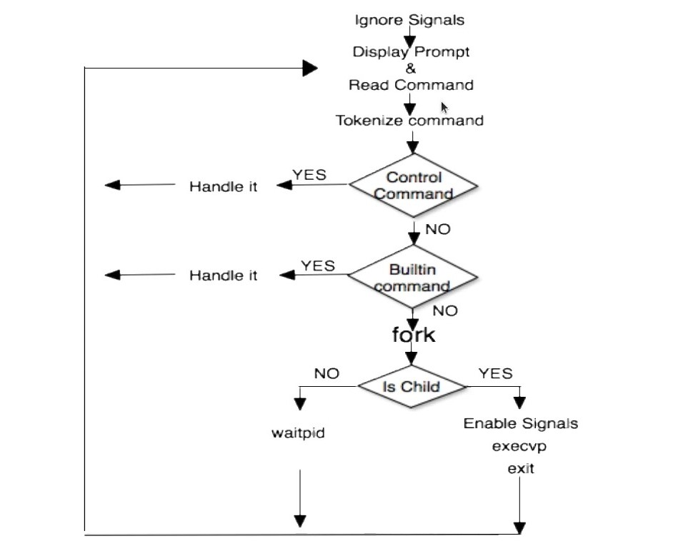

# Pico Shell

##How does the shell works

## Implementing a shell that can do the following

- Built-in echo, pwd, cd, and exit commands.
- Command line parsing to parse the command line entered by the user, divide it into arguments
- If the user entered any thing other than (echo, pwd, cd, exit) the shell executes the command using fork/exec system calls.
Support executing the programs using their names directly
- Handle Some Features
  - I/O Redirection(<, 2>, >)
